# Unit-19-Multi-Blockchain-Wallet-in-Python

### Install Homebrew to run php package

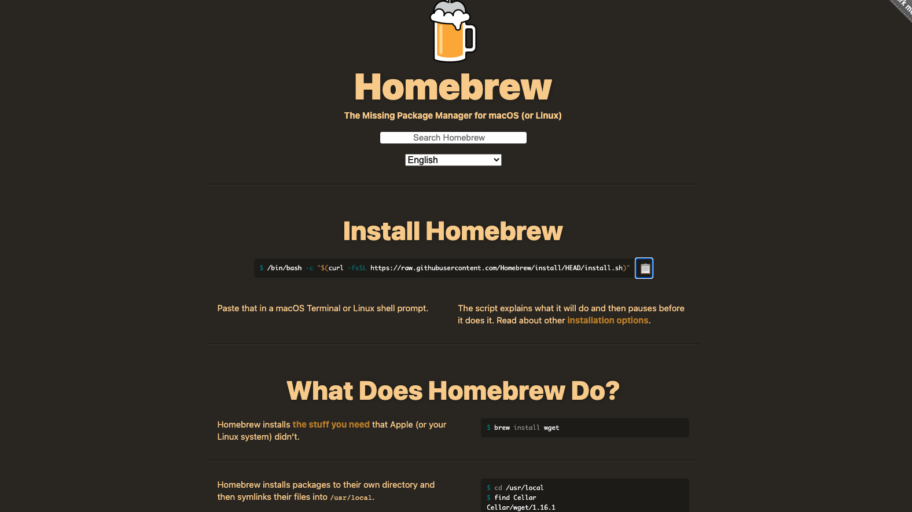

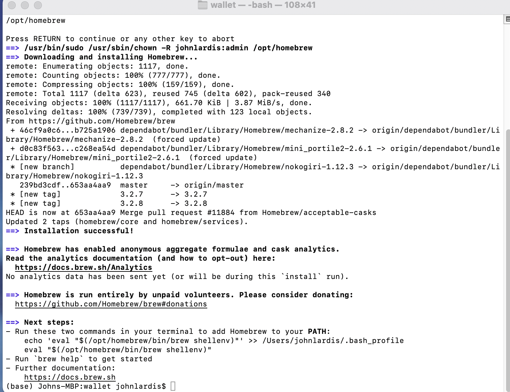
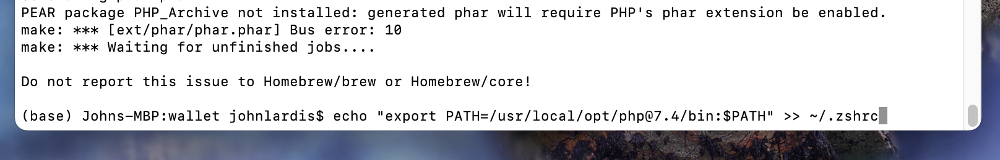

### Check Version of PHP installed 

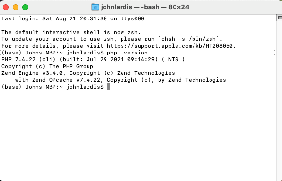

### Clone HD-Derive-Wallet

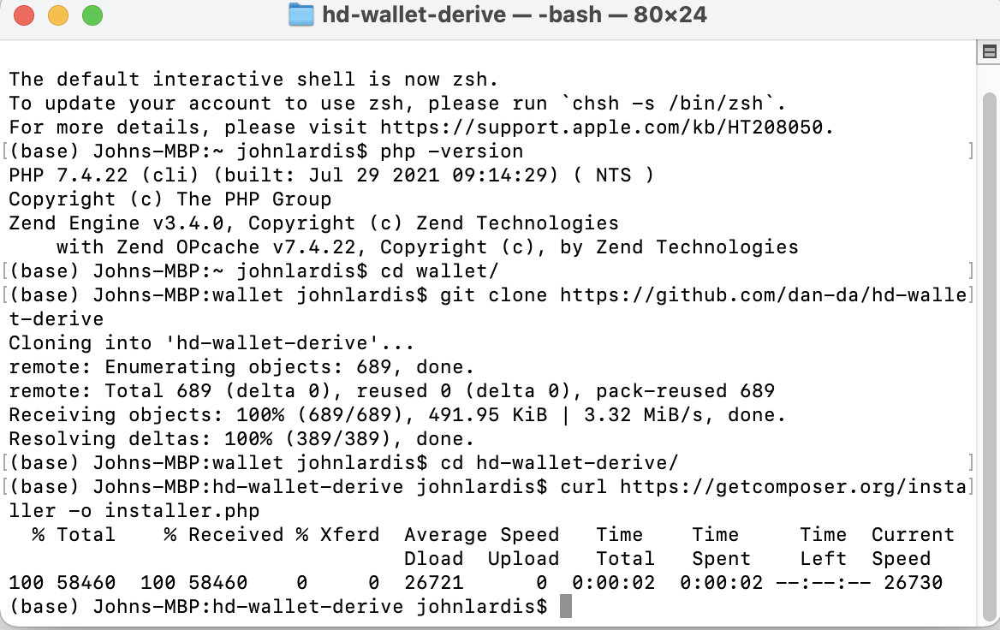

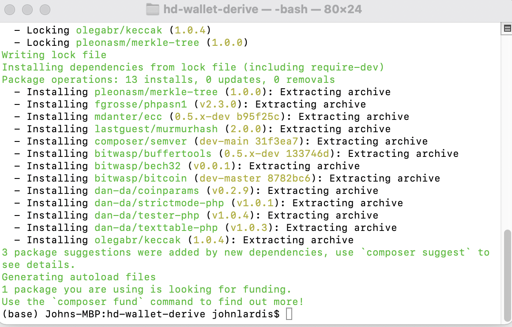

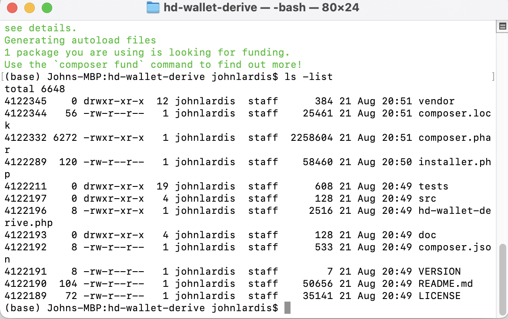

### Check address

### Check file directory

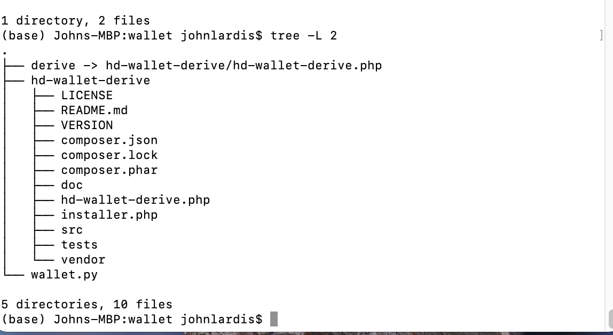

### Create Constants PY.
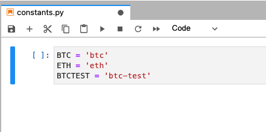

### Create Mnemonic Code

### Add bitcoin to wallet 
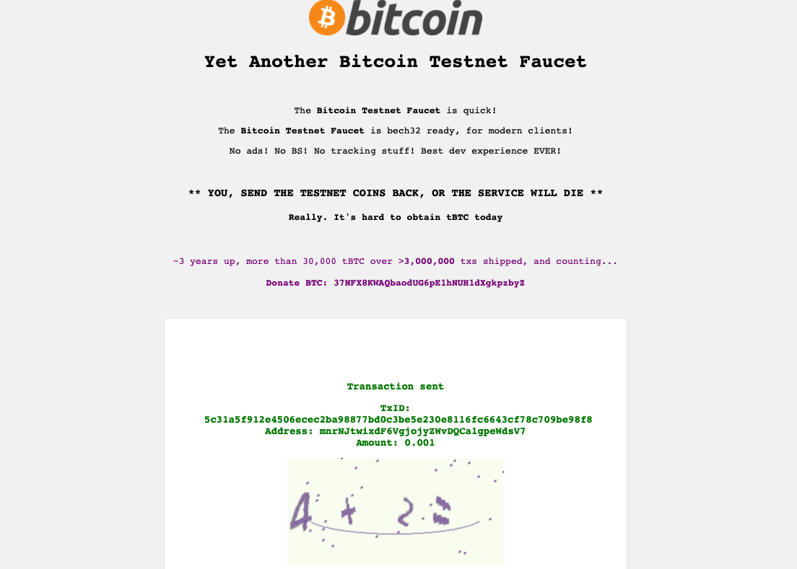

### Test BTC transaction
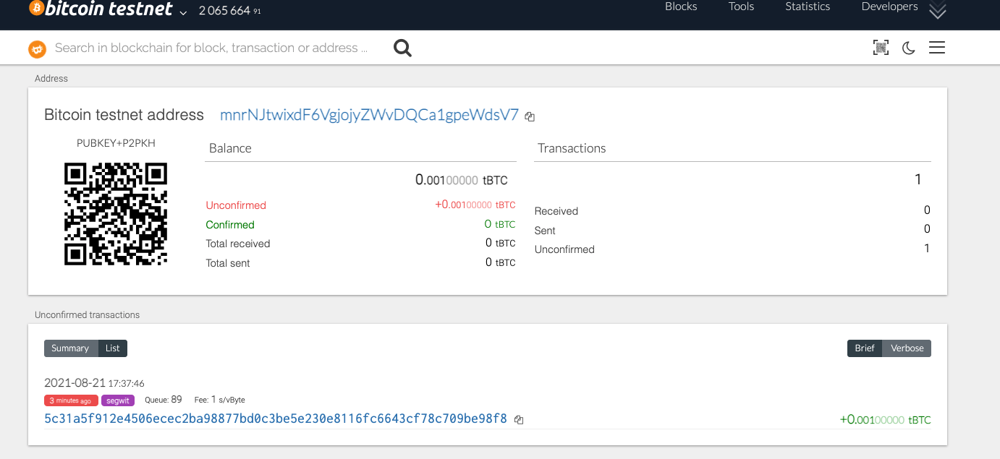
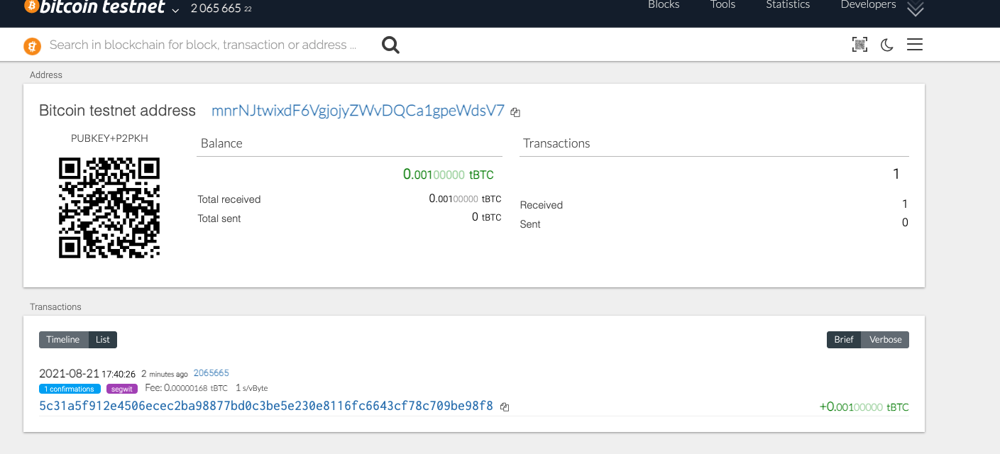

### Create new nodes 
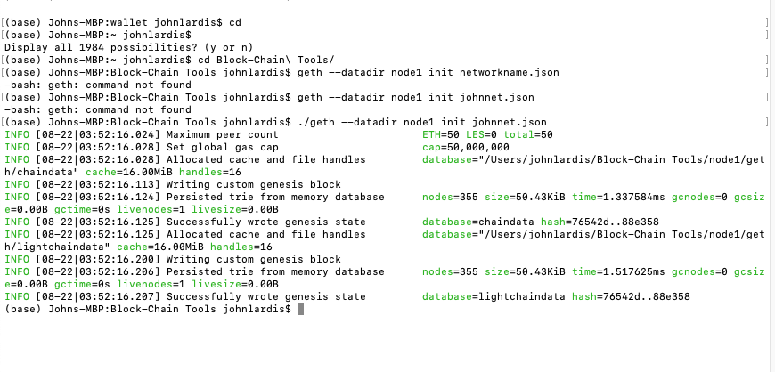

