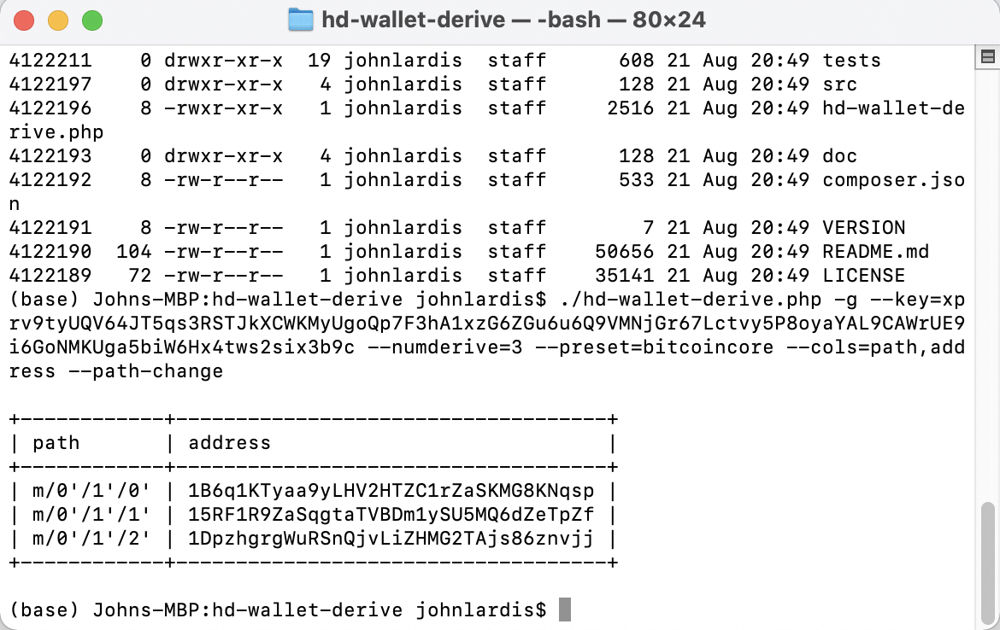
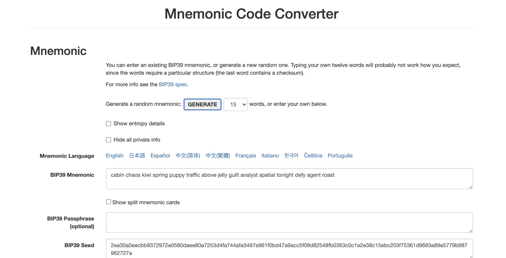

# Unit-19-Multi-Blockchain-Wallet-in-Python

### Install Homebrew to run php package

### Check Version of PHP installed 

### Clone HD-Derive-Wallet

### Check address

### Check file directory

### Create Constants PY.

### Create Mnemonic Code

### Add bitcoin to wallet 

### Test BTC transaction

### Create new nodes 

